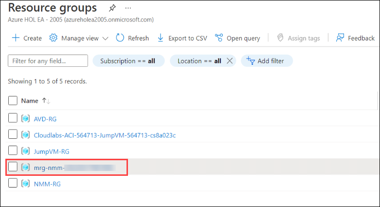
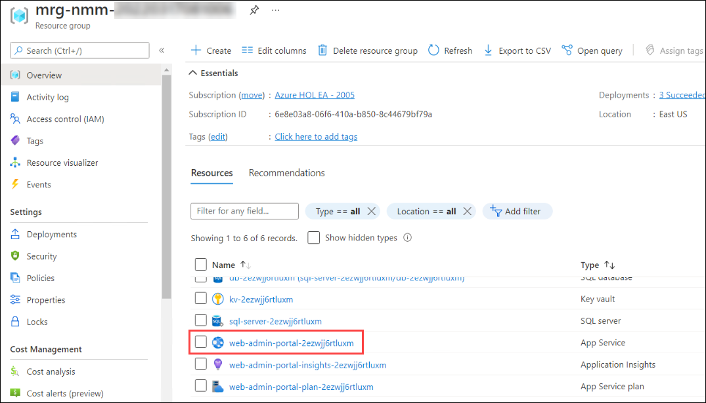
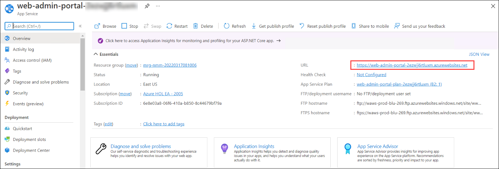
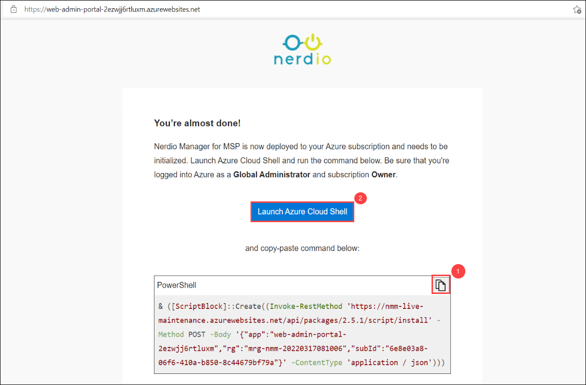

# Lab 1: Create NMM Account

## **Overview**

NMM Partner API allows MSPs to automate various actions in NMM via API that they can do via the NMM portal. For examples, MSPs can create & manage host pools, hosts, desktop images all via the API.

## Exercise 1: Getting started with NMM

1. On the **Azure portal** search for **Resource groups** in the search bar (1) and select **Resource groups** (2) from the suggestions.

   
   
1. Select **mrg-nmm-[unique]** from the list of reosurce groups which is a dynamic RG created during creation NMM resource. It contains all the required resources.

   
   
1. Select the **App service** from the list of resources.

   
   
1. From the App service page, Select the **URL** of the web page to access the Nerdio portal.

   
   
1. From the Web page, **Copy** *(1)* the PowerShell command which you'll be using it later and click on **Launch Azure Cloud Shell** *(2)*
 
   
   
1. Once the Cloud Shell launches, Click on **Show advanced settings** to configure a new storage account.
    
   
   
1. Use existing **JumpVM-RG** for the resource group. Create new storage account as **Storage[Deploymentid]** and blob storage as **blob**.

   
   
1. Once the Cloud Shell is configured, Paste the **PowerShell command** which you copied earlier and press enter.

   >**NOTE**: The execution of the command will take 5 - 10 minutes to complete. Wait till the execution completes.

1. Go to the web page and refresh the web page. Click on **Accept** to provide the neccessary permissions.

   
   
1. Please provide the following details in the registartion page

   - **Company**: Select the default subscription.
   - **Name**: odl_user_{deploymentid}
   - 
