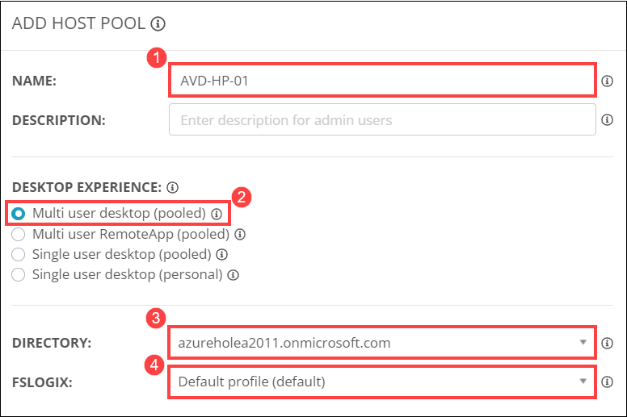
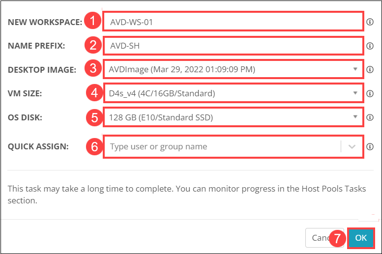
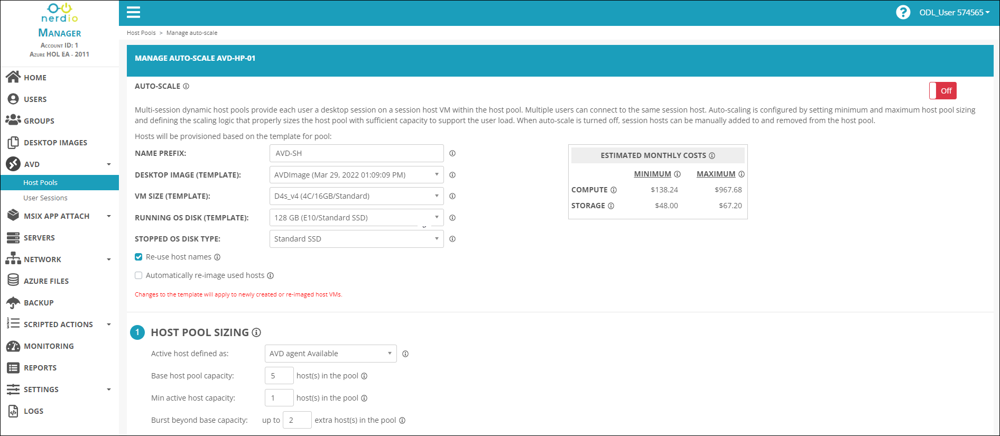
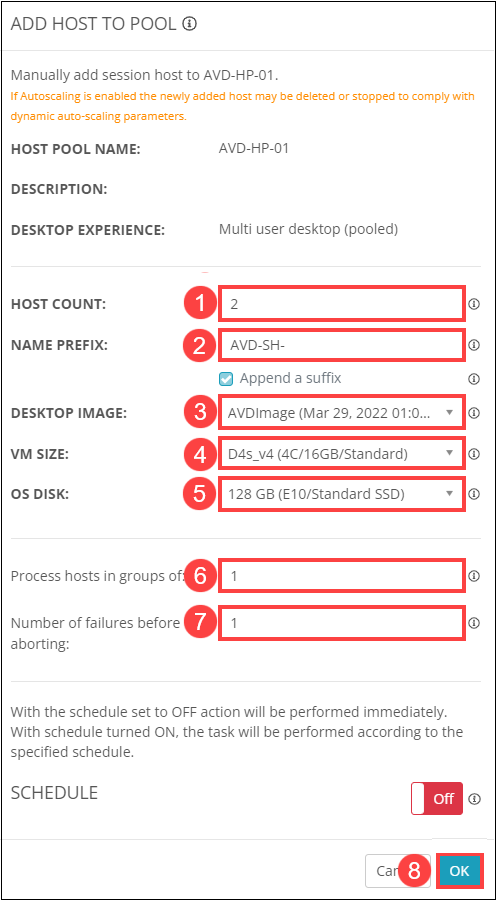

# Lab 2: Create Desktop Image and Host pool

## Exercise 1: Create Desktop Image

1. From the NMM portal, Click on **Accounts** *(1)* from the side blade and click on **Manage** *(2)* on your default NMM Account which you created in Lab 1.

   
   
1. Select **DESKTOP IMAGES** *(1)* from the side blade and click on **Add from Azure library** *(1)* to create a new image.

   
   
1. Provide the following details to create the new desktop image.

   - **NAME**: *AVDImage (1)*
   - **AZURE IMAGE**: *Windows 10 (21H1) EVD + Office ProPlus - Gen2 (mutlsession) (2)*
   - **VM SIZE**: *D4s_v4 (4C/16GB/Standard) (3)*
   - **OS DISK**: *128GB (E10/Standard SSD) (4)*
   - Check ***Join to AD*** *(5)*
   - Click on ***OK*** *(6)*

   
   
   >**NOTE**: Image creation will take 40 - 45 minutes. Please wait untill it completes.
   
1. Once the image creation is completed. You'll be able to see the image in the Desktop image side blade.

   
   
## Exercise 2: Create Host Pool

1. From the NMM portal, Click on **Accounts** *(1)* from the side blade and click on **Manage** *(2)* on your default NMM Account which you created in Lab 1.

   
   
1. From your NMM account home page, Expand the **AVD** *(1)* drop down and Select **Hostpool** *(2)*.

   
   
1. Click on **Add host pool** to create a new host pool.

   
   
1. Provide the following details to create the new host pool.

   - **NAME**: *AVD-HP-01 (1)*
   - **DESKTOP EXPERIENCE**: Select *Multi user desktop (pooled) (2)*
   - **DIRECTORY**: Select the *default Azure AD DS (3)* from the drop down
   - **FSLOGIX**: *Default profile (default) (4)* from the drop down

   
   
   - **NEW WORKSPACE**: *AVD-WS-01 (5)*
   - **NAME PREFIX**: *AVD-SH (6)*
   -  **DESKTOP IMAGE**: Select *AVDImage (7)* from the drop down
   - **VM SIZE**: *D4s_v4 (4C/16GB/Standard) (8)*
   - **OS DISK**: *128GB (E10/Standard SSD) (9)*
   - **QUICK ASSIGN**: Leave it to default *(10)*
   - Click on ***OK*** *(11)*

   

   In **Manage AUTO-SCALE AVD-HP-01** page, Leave all the options to **default** and click on **Save**.
   
   
   
   
   
1. Once the host pool completes. You'll be able to see the **AVD-HP-01** in the host pool side blade. Click on **Manage** *(1)*.

   
   
1. From **AVD-HP-01** host pool page, Click on **Add Session host** to compute instance to the host pool.

   
   
1. Provide the following details to add new session hosts to the host pool.

   - **HOST POOL**: *2 (1)*
   - **NAME PREFIX**: *AVD-SH (2)*
   -  **DESKTOP IMAGE**: Select *AVDImage (3)* from the drop down
   - **VM SIZE**: *D4s_v4 (4C/16GB/Standard) (4)*
   - **OS DISK**: *128GB (E10/Standard SSD) (5)*
   - **Process hosts in groups of**: *1 (6)*
   - **Number of failures before aborting**: *1 (7)*
   - Click on ***OK*** *(8)*

   
   
   >**NOTE**: **Session hosts** creation will take around 30 - 40 minutes to complete. Please wait untill it completes.
   
 1. Once the session hosts creation completes, You'll be able to see the session hosts in the host pool.

    
    
 1. Click on the Next button present in the bottom-right corner of this lab guide.
   
