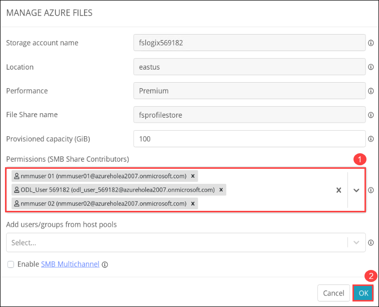
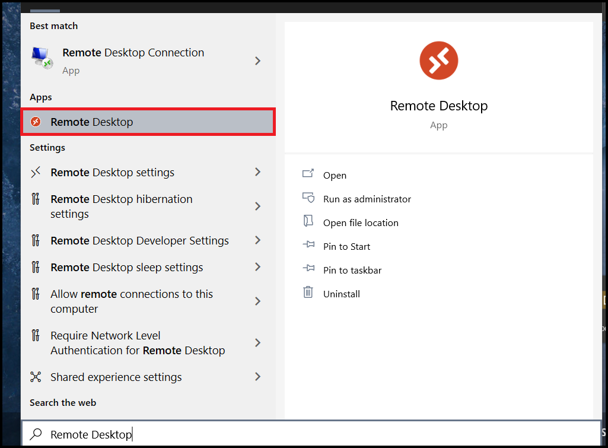
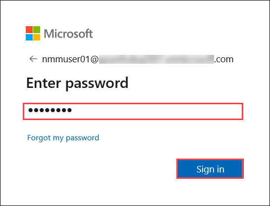
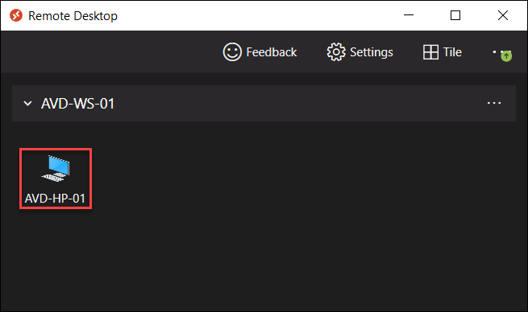
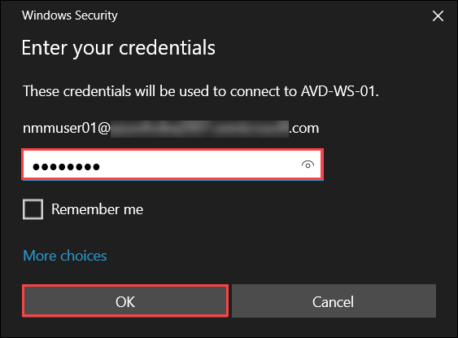
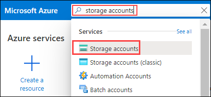
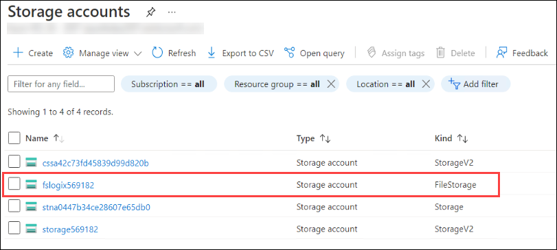

# Lab 4: Configure FSLogix and Access the Desktop using AVD Desktop Client

## **Overview**


## Exercise 1: Create new users for AVD

1. From the NMM portal, Click on **Accounts** *(1)* from the side blade and click on **Manage** *(2)* on your default NMM Account which you created in Lab 1.

   
   
1. Select **AZURE FILES** *(1)* from the side blade and click on **Manage** *(2)* to create a new image.

   

1. In Permissions (SMB Share Contributors), Add **nmmuser01** and **nmmuser02** *(1)* from the drop down and click on **OK** *(2)*.
   
   
   
1. From your NMM account home page, Expand the **AVD** *(1)* drop down and Select **Hostpool** *(2)*.

   
   
1. You'll be able to see the **AVD-HP-01** in the host pool side blade. Click on **Manage** *(1)*.

   
   
1. Click on the **drop down** icon of first session host and click on **Restart**

   
   
1. Similarly, **Restart** the second session hosts and waiting till the Restart task completion.
  
   

## Exercise 2: Access the Desktop using AVD Desktop Client

In this exercise, we will access the Desktop and RemoteApps assigned to us in the previous exercise using the AVD Desktop client.

>#### **Note:** You have to perform this exercise in **Your Own PC/computer/workstation.** Do not perform this exercise within the JumpVM.

1. Open a browser in **Your Own PC/computer/workstation** (not within the JumpVM), copy and paste the following URL in that browser tab.

   ```
   https://docs.microsoft.com/en-us/azure/virtual-desktop/connect-windows-7-10#install-the-windows-desktop-client
   ```

   > **Note:** To download *AVD Mac Client* on **macOS**, use the link given below:
   >
   > ```
   > https://docs.microsoft.com/en-us/azure/virtual-desktop/connect-macos
   > ```

2. Under *Install the Windows Desktop Client*, click on **Windows 64-bit**. This will download the **Remote Desktop Client** on **Your Own PC/computer/workstation**.
   
   
      
3. After the download completes, open the setup to run it. Then on the Welcome page of setup click on **Next**.

4. Check the agreement box and click on **Next**.

5. On the **Installation scope** window select **Install just for you** and then click on **Install**.

   

6. After installation, in your PC go to **Start** and search for **Remote desktop** and open the remote desktop application with the exact icon as shown below.

   
   
7. Once the application opens, click on **Subscribe**.

   
  
8. Enter your **credentials** to access the workspace.

   - Username: *Paste your username* **<inject key="AzureAdUserEmail" />** *and then click on **Next**.*
   
   

   - Password: Paste the password of ***nmmuser01*** which you had copied earlier *and click on **Sign in**.*

   
   
   >**Note:** If there's a popup entitled **Help us protect your account** click **Skip for now (14 days until this is required)**

   

   Make sure to **uncheck** *Allow my organization to manage my device* and click on **No, sign in to this app only**.

   
   
10. The AVD dashboard will launch, then double click on the **Excel** application to access it.

    
    
11. A window saying *Starting your app*, will appear. Wait for a few seconds, then enter the password of ***nmmuser01*** which you had copied earlier and click on **OK**.
   
    
    
12. Wait for the Session Desktop to connect.

    
    
13. Your virtual desktop will launch and look similar to the screenshot below. You can exit from the window by clicking on **X *i.e., the close button***. 
        
   
   
## Exercise 4: Verifying the User profiles stored in File share

1. From the Azure Portal, search for *storage accounts* in the search bar and click on **Storage Accounts** from the suggestions.

   
   
1. Select the **fslogix{deploymentid}** storage account which was created while creating the NMM account.

   
   
1. Select **Fileshare** from the left side menu.

   
   
1. Click on the **fsprofilestore** file share.

   
   
1. You will see the user folder created in the file share, click on the folder.

   
   
7. Now you will be able to see the user profiles data stored in the filesharers in a ***.vhd*** format.

   
     
14. Click on the **Next** button present in the bottom-right corner of this lab guide. 
    
