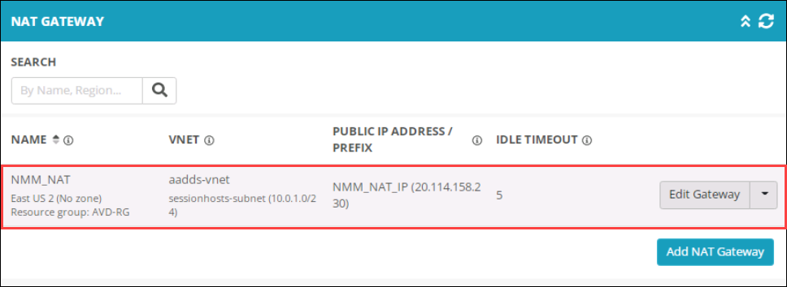

# Lab 7: Configure Network by adding NAT Gateway

## Overview

Virtual Network NAT (network address translation) simplifies outbound-only Internet connectivity for virtual networks. When configured on a subnet, all outbound connectivity uses your specified static public IP addresses. Outbound connectivity is possible without a load balancer or public IP addresses directly attached to virtual machines. NAT is fully managed and highly resilient.

## Exercise 1: Access Azure Monitor using Nerdio Manager

In this exercise, you'll be congiguring NAT gateway for the existing virtual network and assign new public IP address.

1. From the NMM portal, Click on **Accounts** *(1)* from the side blade and click on **Manage** *(2)* on your default NMM Account which you created in Lab 1.

   
   
1. Select **NETWORK** *(1)* drop down from the side blade. Select **NAT Gateway** *(2)* and click on **Add NAT Gateway** *(3)*.

   
   
1. In ADD NAT GATEWAY window, Provide the following details to create new NAT gateway.

   - **NAME**: *NMM_NAT (1)*
   - **RESOURCE GROUP**: *AVD-RG (2)*
   - **REGION**: *<inject key="Resource group Location" /> (3)*
   - **VNET**: *aadds-vnet (4)*
   - **SUBNETS**: *sessionhosts-subnet (5)*
   - **IDLE TIMEOUT**: *5 (6)*
   - **AVAILABILITY ZONE**: *No Zone (7)*
   - **PUBLIC IP ADDRESS**: Select ***Create new Public_IP*** *(8)* and provide name as ***NMM_NAT_IP*** *(9)*
   - Click on ***OK*** *(10)*

   
   
1. Once the creation task completes, You'll be able see and manage your new NAT gateway.

  
