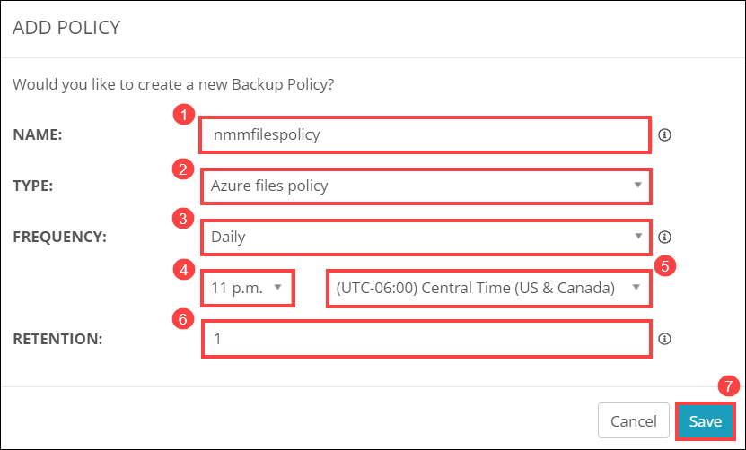
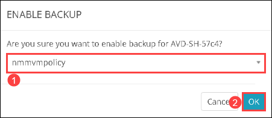

# Lab 7: Create Backup

## Overview

The Azure Backup service provides simple, secure, and cost-effective solutions to back up your data and recover it from the Microsoft Azure cloud. In this lab, you'll be creating a backup recovery vault, configuring policies to that vault and enabling backup for those policies.

## Exercise 1: Create Recovery service vaults and policy

In this exercise, you'll be creating a recovery vault and backup policies in your NMM Account.

1. 1. From the NMM portal, click on **ACCOUNTS** *(1)* from the side blade and click on **Manange** *(2)* on your NMM Account.

   

1. Click on **Settings** *(1)* from the side blade and then click on **Integrations** *(2)* from the drop down.
 
   
   
1. Click on **Add Vault** on the *Integrations* page under **Backup recovery vaults, policies and assignments**.

   
   
1. Provide the following details to add a new vault.

   * **NAME**:  *nmmvault* *(1)*
   * **RESOURCE GROUP**:  *AVD-RG* *(2)*
   * **REGION**:  *EAST US 2* *(3)*
   * **REPLICATION TIME**:  *Geo-redundant* *(4)*
   * click on **Save** *(5)*
   
   
   
1. In the *Integrations* page, click on **Add policy** under **Backup recovery vaults, policies and assignments**.

   
   
1. In **ADD POLICY** page, provide the following details to add a new policy.

   * **NAME**:  *nmmvmpolicy* *(1)*
   * **TYPE**:  *Virtual Machine policy* *(2)*
   * **FREQUENCY**:  *Weekly* *(3)*
   * **Friday** *(4)*
   * **11 p.m.** *(5)*
   * **(UTC-06:00) Central Time (US $ Cannada)** *(6)*
   * **RETENTION**:  *1* *(7)*
   * Click on **Save** *(8)
   
   
   
1. In the *Integrations* page, again click on **Add policy** under **Backup recovery vaults, policies and assignments**.

   
   
1. In **ADD POLICY** page, provide the following details to add another new policy.

   * **NAME**:  *nmmfilespolicy* *(1)*
   * **TYPE**:  *Azure files policy* *(2)*
   * **FREQUENCY**:  *Daily* *(3)*
   * **11 p.m.** *(4)*
   * **(UTC-06:00) Central Time (US $ Cannada)** *(5)*
   * **RETENTION**:  *1* *(6)*
   * Click on **Save** *(7)*
   
   
   
## Exercise 2: Enable Backup for Session desktop and File share

In this exercise, you'll be enabling backup for the policies that you created in the previous exercise.

1. From the NMM portal, click on **ACCOUNTS** *(1)* from the side blade and click on **Manange** *(2)* on your NMM Account.

   
   
1. Click on **BACKUP** *(1)* and then click on **Enable backup** *(2)* for the first *Pooled session host*.

   
   
1. In **ENABLE BACKUP** page, select **nmmvmpolicy** *(1)* fromm the drop down and click on **OK** *(2)*.

   
   
1. Similarly, click on **BACKUP** *(1)* and then click on **Enable backup** *(2)* for the second *Pooled session host*.

   
   
1. In **ENABLE BACKUP** page, select **nmmvmpolicy** *(1)* fromm the drop down and click on **OK** *(2)*.

   
   
1. Similarly, click on **BACKUP** *(1)* and then click on **Enable backup** *(2)* for the *Azure Files share*.

   
   
1. In **ENABLE BACKUP** page, select **nmmfilespolicy** *(1)* fromm the drop down and click on **OK** *(2)*. 

   
