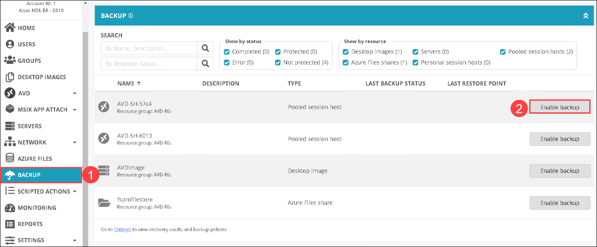
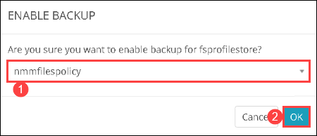

# Lab 9: Create Backup

## Overview

The Azure Backup service provides simple, secure, and cost-effective solutions to back up your data and recover it from the Microsoft Azure cloud. In this lab, you'll be creating a backup recovery vault, configuring policies to that vault and enabling backup for those policies.

## Exercise 1: Create Recovery service vaults and policy

In this exercise, We'll be creating a recovery vault and backup policies in your NMM Account.

1. From the NMM portal, click on **ACCOUNTS** ***(1)*** from the side blade and click on **Manange** ***(2)*** on in the NMM Account.

   

1. From the NMM portal, On the left-hand side blade click on **Settings** ***(1)*** and select **Integrations** ***(2)***.
 
   
   
1. Under **Backup recovery vaults, policies and assignments**, Click on **Add Vault**.

   
   
1. Provide the following details to add a new vault, and click on **Save** ***(5)***.

   - NAME:  **nmmvault** ***(1)***
   - RESOURCE GROUP:  Select**AVD-RG** ***(2)*** from the drop down
   - REGION:  **<inject key="Resource group Location" enableCopy="false" />** ***(3)***
   - REPLICATION TIME: Select **Geo-redundant** ***(4)*** from the drop down
   
   
   
1. Under **Backup recovery vaults, policies and assignments**, Click on **Add policy**.

   
   
1. Under **ADD POLICY**, provide the following details and click on **Save** ***(8).

   - NAME:  **nmmvmpolicy** ***(1)***
   - TYPE:  **Virtual Machine policy** ***(2)***
   - FREQUENCY: Select **Weekly** ***(3)*** from the drop down, Select **Friday** ***(4)***, select**11 p.m.** ***(5)*** from the drop down, and select your time zone ***(6)***.
   - RETENTION:  **1** ***(7)***
   
   
   
1. Under **Backup recovery vaults, policies and assignments**, Click on **Add policy**.

   
   
1. Under**ADD POLICY**, provide the following details and click on **Save** ***(7).

   - NAME: **nmmfilespolicy** ***(1)***
   - TYPE: **Azure files policy** ***(2)***
   - FREQUENCY: select **Daily** ***(3)*** from the drop down, select **11 p.m.** ***(4)*** from the drop down, and and select your time zone ***(5)***.
   - RETENTION: **1** ***(6)***
   
   
   
## Exercise 2: Enable Backup for Session desktop and File share

In this exercise, We'll be enabling backup for the policies that we created in the previous exercise.
   
1. From the left-hand side blade, Click on **BACKUP** ***(1)*** and then click on **Enable backup** ***(2)*** for the first session host.

   
   
1. Under**ENABLE BACKUP**, select **nmmvmpolicy** ***(1)*** from the drop down and click on **OK** ***(2)***.

   
   
1. Similarly, click on **BACKUP** ***(1)*** and then click on **Enable backup** ***(2)*** for the second session host.

   
   
1. Under **ENABLE BACKUP**, Select **nmmvmpolicy** ***(1)*** from the drop down and click on **OK** ***(2)***.

   
   
1. From the left-hand side blade, Click on **BACKUP** ***(1)*** and then click on **Enable backup** ***(2)*** for the *Azure Files share*.

   
   
1. Under **ENABLE BACKUP**, select **nmmfilespolicy** ***(1)*** fromm the drop down and click on **OK** ***(2)***. 

   
   
1. Click on the **Next** button present in the bottom-right corner of this lab guide.

