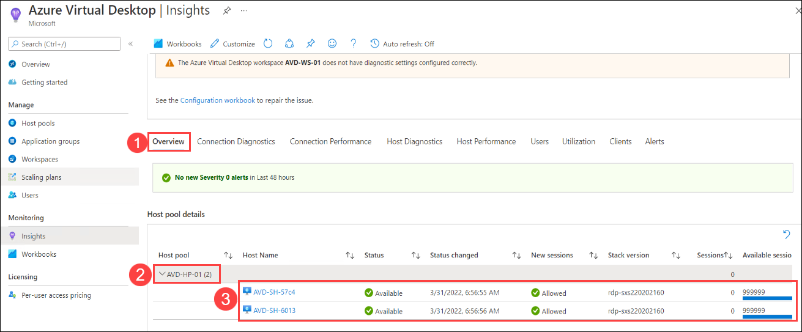
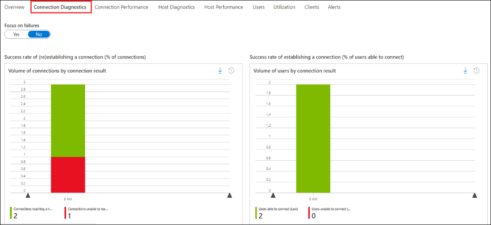
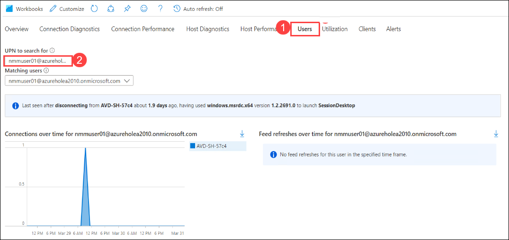

# Lab 10: Monitoring using Azure Monitor for AVD

## Overview

Azure Monitor helps you maximize the availability and performance of your applications and services. Nerdio Manager for MSP lets us view the Azure Monitoring insights through the NMM Portal. In this lab, you'll be accessing the Azure Monitor using Nerdio Manager for MSP and monitoring the Azure Virtual Desktop in the Azure portal.

## Exercise 1: Access Azure Monitor using Nerdio Manager

In this exercise, We'll be accessing the Azure Monitor using Nerdio Manager to monitor the Azure Virtual Desktop. 

   
1. From the left-hand side blade, Click on **Monitoring**.

   
  
1. Under the Monitoring Insights pop up, Click on **Continue** which will redirect to the AVD Insights page in the Azure portal.

   
   
1. Under **Azure Virtual Desktop | Insights**, **Click** on **Overview** tab *(1)* and **expand** *(2)* the **AVD-HP-01** host pool. You'll be able to monitor the status and health of the session hosts (3).

   
   
1. Click on the **Connection Diagnostics** tab, This tab gives us information about Session connections and connectivity rate insights.

   
   
1. Click on the **Users** *(1)* tab, Enter **<inject key="NMM User 01" />** *(2)* under **UPN to search for**, and wait for the data to load. This tab gives an overview of the user's usage. Scroll down and explore different information loaded.

   
   
1. Click on the **Utilization** tab, This tab gives us information about sessions summary, core info, and more information about the utilization of resources.

   
   
1. Click on the **Clients** *(1)* tab, Here we'll be able to monitor the number of users connected to AVD using the browser and remote client application.

   
   
1. Spend some time on the page to explore different monitoring abilities offered by Azure Insights.

1. Click on the **Next** button present in the bottom-right corner of this lab guide.

